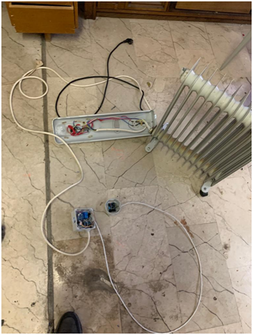
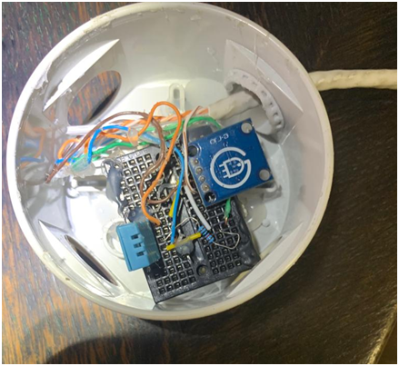
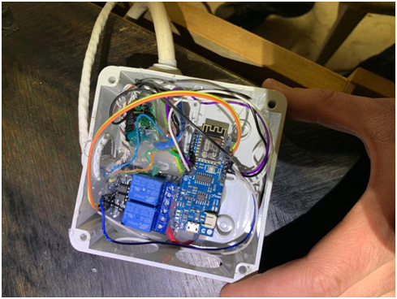
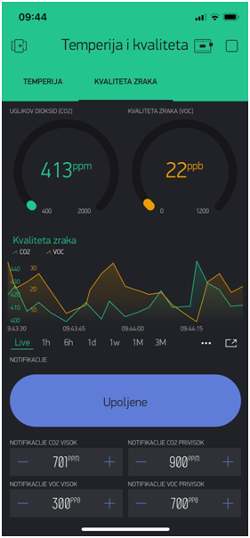
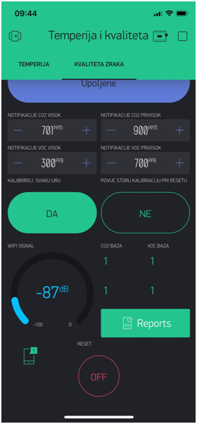
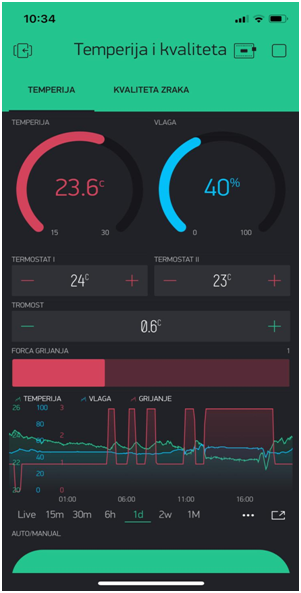
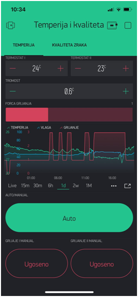

# Digital-thermostat-smart-radiator-and-indor-quality-air-detector
Components used: Arduino ESP 8266, old oil radiator, two relays, DHT11 temperature sensor, power supply and SGP30 sensor.

An "smart radiator" was made from an old oil radiator that has a thermostat located on the radiator itself. The oil radiator does not "know" the information about the space heating, but the thermostat only has the role of regulating the temperature on the radiator itself. The user can see the temperature and humidity in the room on the application interface as well as enter the desired temperature at which the radiator will be lit. Since the oil radiator has two heating stages, the temperature can be entered separately when the heating will be switched on at both heating intensity levels. It can also switch off the automatic and manually switch on both heating stages separately.

Also the user can see the historical display of temperature and humidity measurements as well as when the radiator was running at what heating level. Since the power consumption of the radiator is known, it is very easy to show the electricity consumption of the radiator. In addition to adaptations, the existing system can also be mounted on various heating systems. Like any form of central heating, the system would in this case, depending on the temperature, drive a pump that pushes the hot medium into the radiators for a particular room in which the measurement is performed.
The sgp30 sensor (carbon dioxide and air quality) is connected to the same Arduino microcontroller. The user receives notifications on the mobile device when he should open the windows and clear the room in which the system is located. Also, the user has the current display of air quality and carbon dioxide on the application interface as well as the historical one on the diagram, and can turn off notifications or enter the desired values to which he will receive notifications.
Blynk is only used to display data and enter new management data. In case of unavailability of the Internet or local network, the microcontroller continues with the default work, only the user will not have access to the application until the microcontroller is reconnected to the network. Also in case of resetting the microcontroller and at that moment when the network is unavailable, the microcontroller continues with the default operation with the default settings until it is reconnected to the wifi network.

The microcontroller, power supply and relays should be in a separate housing from the DHT11 and SGP30 sensors so that their heating affects the measurements. The sensors are mounted in the most adequate place in the room for reading the temperature and air quality. Because this is exactly the temperature reference point for heating control.

Through the Blynk application in the TEMPERIJA tab, the user has an insight into the current and historical display of temperature and humidity measurements. It has the option of entering the desired temperature at which the heating will be switched on, separately for two different heating stages. Input THERMOSTAT I is used to set the temperature for switching on the first heating stage (Power 833W), while the second input THERMOSTAT II is used to set the temperature for switching on the second heating stage (Power 1666W). On the example of inertia of 0.5c, if it is set to turn on at 23c it turns off only at 23.5c. HEATING FORCE represents the power level at which the heating works (from 1 to 3).
The user can see in the diagram at what stage and at what temperature the heating was running.
By pressing the AUTO / MANUAL button, the user can switch off the automatic. Then, by pressing the HEATING AND MANUAL and HEATING II buttons, the MANUAL can switch the heating on and off regardless of the room temperature.

In the AIR QUALITY tab, the user has an insight into the current values of eCO2 and VOC, as well as a curved display on the diagram. It has insight into the WIFI signal of the microcontroller and can manage notifications. It can turn off notifications as well as set values to which it will receive notifications for CO2 High, CO2 too high, VOC high and VOC too high. The other two buttons are used to calibrate the sensor.

